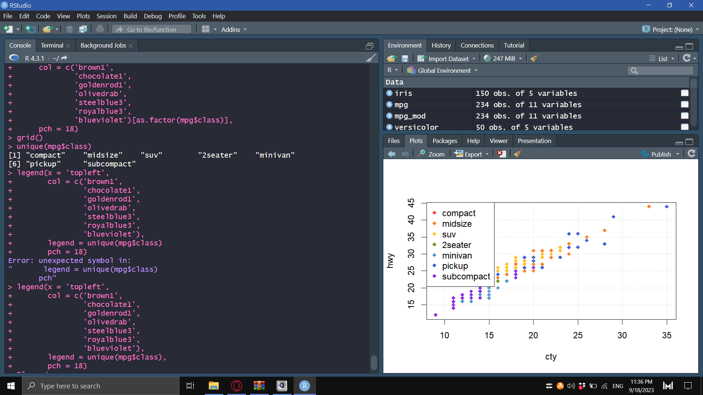
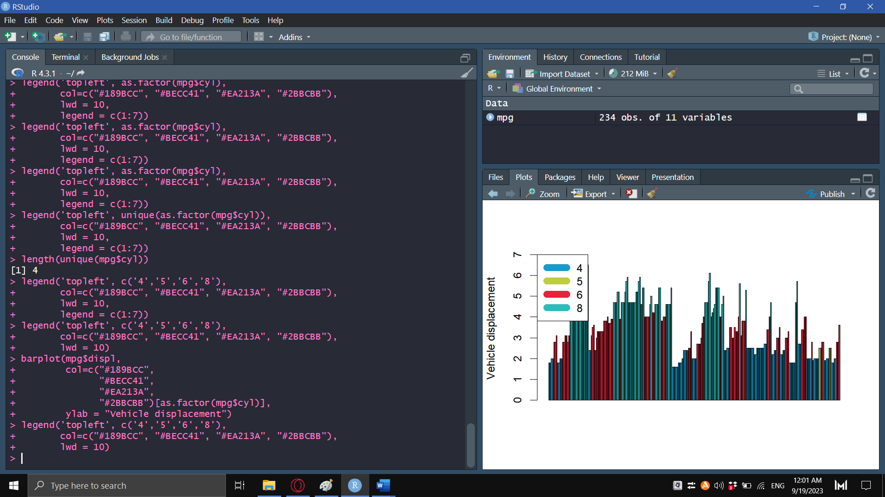

# Hands-On-Outputs

## Output 1

**Create a single scatter plot using different markers and colors for each iris species. Save the image and upload it as an output for today’s activity.**

```{r}
plot(iris$Petal.Length, iris$Petal.Width,
     xlab = "Petal Length",
     ylab = "Petal Width",
     main = "Scatter Plot: Petal Length vs Petal Width",
     col=c("brown1","dodgerblue1","limegreen")[as.integer(iris$Species)],
     pch = c(16,17,18)[as.integer(iris$Species)])
legend(x = 'topleft',
       legend = c('setosa','versicolor','virginica'),
       col=c("deeppink","deepskyblue3","chartreuse3"),
       pch = c(16,17,18))
grid()
```

## Output 2
**Create horizontal bar plots for the remaining continuous variables in the iris dataset. Use the command ?barplot to see which argument to include in the command.**
```{r}
barplot(iris$Petal.Length, col = c("brown1","dodgerblue1","limegreen")[iris$Species], ylab = "Petal length", xlab = "Iris")
legend("topleft", c("setosa", "versicolor", "virginica"), col=c("brown1","dodgerblue1","limegreen"), lwd=10)

barplot(iris$Sepal.Length, col = c("brown1","dodgerblue1","limegreen")[iris$Species], ylab = "Sepal length", xlab = "Iris")
legend("topleft", c("setosa", "versicolor", "virginica"), col=c("brown1","dodgerblue1","limegreen"), lwd=10)

barplot(iris$Sepal.Width, col = c("brown1","dodgerblue1","limegreen")[iris$Species], ylab = "Sepal width", xlab = "Iris")
legend("topleft", c("setosa", "versicolor", "virginica"), col=c("brown1","dodgerblue1","limegreen"), lwd=10)
```

## Output 3
**Create histograms using the sepal length for the versicolor species using the following breaks: 5, 10, 20, 30.**
```{r}
hist(iris$Sepal.Length, xlab = "Sepal Length", ylab = "Frequency", main = "Histogram of Sepal Length", breaks = 5)

hist(iris$Sepal.Length, xlab = "Sepal Length", ylab = "Frequency", main = "Histogram of Sepal Length", breaks = 10)

hist(iris$Sepal.Length, xlab = "Sepal Length", ylab = "Frequency", main = "Histogram of Sepal Length", breaks = 20)

hist(iris$Sepal.Length, xlab = "Sepal Length", ylab = "Frequency", main = "Histogram of Sepal Length", breaks = 30)
```

# Exercises

Use the *mpg* dataset for the following exercises. You need to load the **ggplot2** package first. Exert effort to customize and improve the aesthetic quality of your plots. **Take a screenshot of your console showing the code, and the chart output.**

## Exercise 1
**Create a scatterplot where the x axis is “cty” and the y axis is “hwy”. Color the data points by class category.**


## Exercise 2
**Create the appropriate plot to determine which fuel type yields the best city driving mileage. Make sure that all axes are properly labeled. Why did you select your chosen plot?**


## Exercise 3
**Create a vertical barplot that shows the vehicle displacement (displ) and is colored based on the number of gears.**
